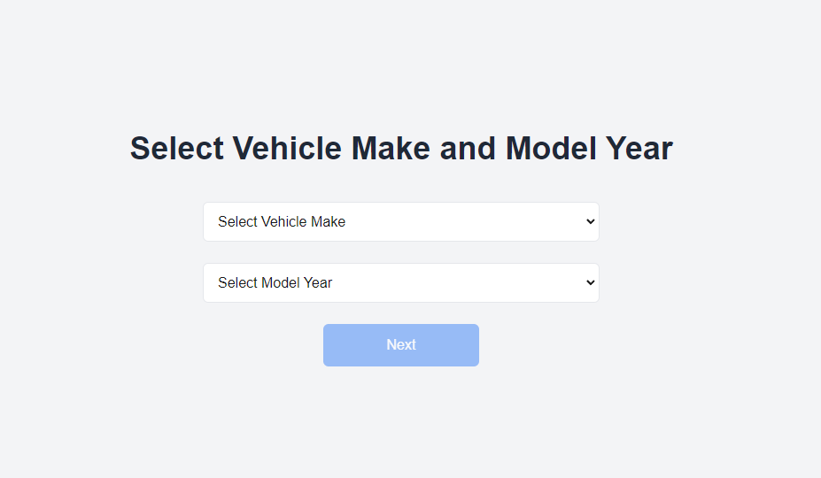

# Vehicle Filter App

## Screenshot

## How to Run

1. Clone the repo
2. Run `npm install` to install dependencies
3. Run `npm run dev` to start the development server

## Features

- Filter vehicles by make and model year
- Display vehicle models using the NHTSA API